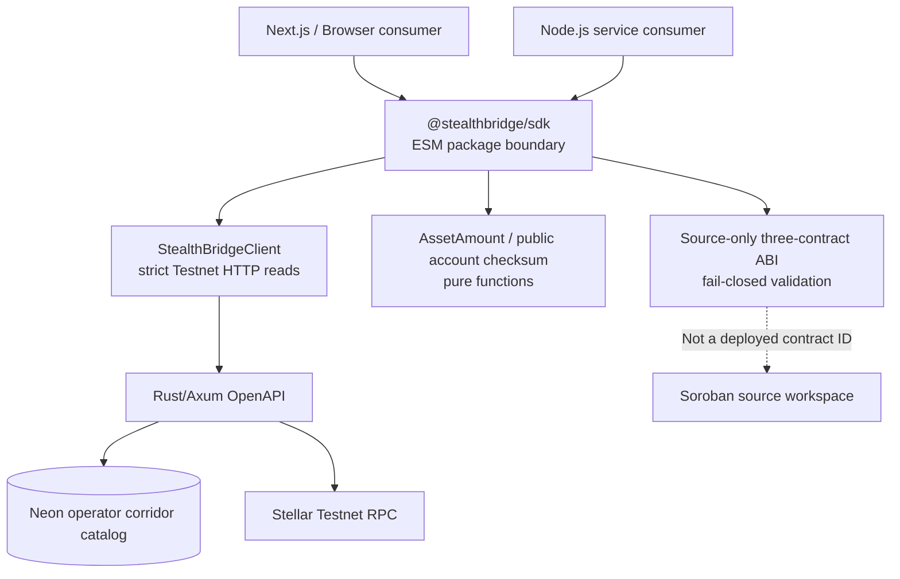
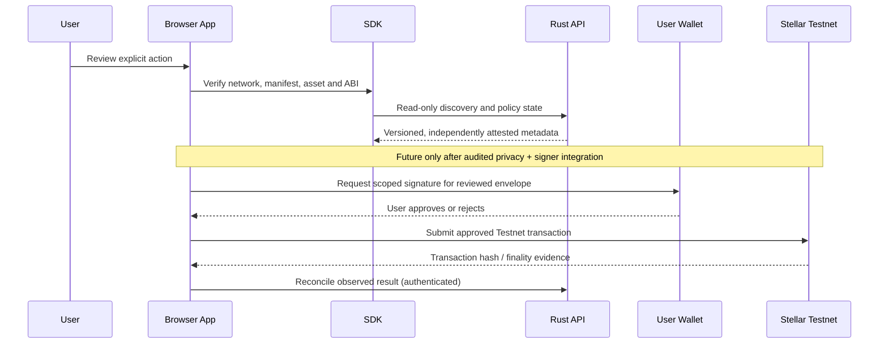

# SDK Architecture and Delivery Plan

> `@stealthbridge/sdk` is a **private, unpublished, Testnet-only, read-oriented TypeScript package**. It does not sign transactions, generate cryptographic proofs, control custody, or settle payments. GitHub CI/published tarball fixtures validate package compatibility, not financial readiness.

## Mission

Provide one carefully versioned developer surface across frontend, backend and future approved Soroban interactions. Consumers should not have to duplicate every corridor, asset, network and contract-data parser. The SDK must faithfully express **unknown**, **degraded**, **unverified**, and **not enabled** states rather than inventing optimistic defaults.

The intended product is two layers: (1) stable typed observation and pure domain utilities; (2) later, explicitly authorized contract and wallet adapters which cannot be enabled until independent deployment, cryptographic and signing evidence exists.

## Implementation structure

No browser-facing build may contain a provider API token, database credential, wallet seed, chain signer or server-only privileged adapter. Preserve ESM exports and avoid deep imports into unpublished internal `dist/*` paths.

## Current developer capabilities

- Typed network reads, explicit `liveNetwork({maxAgeSeconds})` freshness checking, health and readiness.
- Real operator-configured corridors, bounded page/scan methods and single-corridor lookup; no guessed quote or payout.
- Public Testnet transaction inclusion/status from the backend without raw XDR or protected events.
- Explicit payment capability flags: reject any unsupported upstream claims that private transfer, confidential tokens or fiat payouts are enabled.
- Source-only contract discovery: compare the backend output against the reviewed method inventory and current `not-deployed` manifest.
- Pure fixed-precision amount/asset-identity helpers; no floating point for financial amounts.
- `canonicalStellarAccountAddress` validates classic G-address checksums locally; this is **not** wallet authentication.
- Pinned package consumer tests across Node ESM, TypeScript, esbuild/browser and Next.js App Router; budgeted bundle sizes.

See [README](../README.md) for supported methods, package checks and exact current exports. The package is a **library**, not a Vercel website; deployment means a reviewed versioned package release and integration test, not publishing a serverless page.

## HTTP and chain security contracts

1. **Origin:** reject non-local plaintext HTTP and network targets other than Testnet; allow bounded caller-supplied timeouts and abort signals.
2. **Responses:** parse strict JSON object shapes and bounded values; expose typed `ApiError` without copying upstream details. Never convert a 404/502/503 into synthetic success.
3. **Ledger:** check passphrase/sequence/hash/protocol and optionally freshness; RPC availability does not establish custody, proof validity or settlement completion.
4. **Corridor:** a record is a public operator configuration. It is **not** evidence of a real partner, spendable stablecoin, approved KYC status or available FX.
5. **Contracts:** one canonical JSON source interface in the contracts repository, mirrored by the backend and SDK with CI checks. All three Soroban crates have read names, typed argument contracts and separate admin writes. `on_chain_verified=false` must remain authoritative until an audited deployment manifest is independently checked.
6. **Wallet:** a public G-address identifies an account format only. Future cryptographically verified sessions, delegated authorization and Freighter/other signer consent are separate products.
7. **Transactions:** do not retry anything that might submit value unless the on-chain effect and idempotency domain are proved safe. Current SDK has **no payment submit method**.

## Future adapter boundaries

**The lower half is not currently implemented.** It is a proposed authorization and observation boundary. A wallet-connection click must never call an unsigned or preauthorized transfer. Account recovery, note encryption, zero-knowledge proving and FIAT off-ramp are different packages with independent trust reviews.

## Versioning and compatibility strategy

- **HTTP boundary:** backend `api/openapi.yaml` is authoritative. Introduce schema generation and drift tests before publishing independent SDK releases.
- **Contract boundary:** pinned source-interface JSON is a development artifact. After independent chain deployment, introduce versioned *attested* manifests and generated clients keyed by actual on-chain bytecode hash, not a single mutable contract address.
- **Packages:** keep explicit exports, generated declaration files and semver guarantees. Pin downstream CI to a reviewed tarball/release, not whichever `main` happened to build.
- **Failure classes:** validate locally before requests; distinguish transport, stale ledger, wrong network, schema mismatch, no records, not-deployed and blocked financial action. Never convert unknown to enabled.
- **Size/supply-chain:** maintain lockfile, packed tarball inventory and checksums; sign/attest published releases and document dependencies and provenance.

## Delivery gates

| Gate | Output | Proof of completion |
| --- | --- | --- |
| S1 — Read-only client | Testnet typed reads, corridor paging, public status, amount and address utilities | Offline fixtures, Node/Next/browser package installs, upstream compatibility tests |
| S2 — Shared models | Generated OpenAPI package, platform-wide error codes, consistent readiness/capabilities | Pinned backend CI contract and frontend consumption |
| S3 — Attested Soroban reads | Contract ID/network/ABI/code-hash aware read client | Independently verified actual Testnet contracts and adversarial response fixtures |
| S4 — Wallet adapter | Scoped account/network inspection and intentionally user-confirmed signing interface | Human-approval UX, wallet revocation, wrong-network/fee replay tests |
| S5 — Privacy rail adapter | Correct verified proof and note interfaces with recovery strategy | Version-pinned upstream, test vectors, security review and end-to-end Testnet evidence |
| S6 — Published developer platform | Versioned npm package, docs/examples and support matrix | Signed release, audits/licenses, changelog, versioned compatibility fixtures |

## Maintainer checklist

Before any SDK change: verify source authority, update types and runtime validators together, record unsupported states, keep secrets out of bundles, run `npm run verify`, exercise package fixture imports, and coordinate frontend/backend/contract revisions. Do not claim an SDK has "deployed" merely because GitHub Actions passed.

Further reading: [Developer guide](DEVELOPER-GUIDE.md), [Amount safety](AMOUNTS.md), [Compatibility](../specs/COMPATIBILITY.md), [Roadmap](../ROADMAP.md), and the [organization platform plan](https://github.com/stealthbridge-labs/.github/blob/main/docs/PLATFORM-VISION-AND-ARCHITECTURE.md).
